# 🛍️ ShoppyGlobe E-commerce App

A full-stack e-commerce app with product listings, cart functionality, and user authentication.

---

## 📑 Table of Contents

* [🚀 Tech Stack](#-tech-stack)
* [🧾 Features](#-features)
* [🗄️ MongoDB Integration](#️-mongodb-integration)
* [🧪 ThunderClient + MongoDB Atlas Testing](#-thunderclient--mongodb-atlas-testing)
* [📁 Folder Structure](#-folder-structure)
* [🔧 Environment Variables](#-environment-variables)
* [📦 Installation](#-installation)
* [🚀 Deployment](#-deployment)
* [👤 Author](#-author)

---

## 🚀 Tech Stack

**Frontend:** React, CSS, Axios, React Router
**Backend:** Node.js, Express.js, MongoDB (Atlas)
**Authentication:** JWT

---

## 🧾 Features

* User login & signup
* Browse products
* Add to cart (protected route)
* Dynamic cart count & user info
* Protected checkout route

---

## 🗄️ MongoDB Integration

**Database:** `shoppyglobe`

**Collections:**

* `products`: Stores product data (name, price, description, stock)
* `carts`: Stores cart items (product IDs and quantities)
* `users`: Stores user authentication data

**CRUD Operations:**

* **Products:** Create, Read, Update, Delete
* **Cart Items:** Add to Cart, Update Quantity, Remove Items, Clear Cart

---

## 🧪 ThunderClient + MongoDB Atlas Testing

All API endpoints tested using ThunderClient with results verified in MongoDB Atlas.

### 🧍 Authentication Routes

| API Route                 | Description              | ThunderClient Screenshot | MongoDB Screenshot           |
| ------------------------- | ------------------------ | ------------------------ | ---------------------------- |
| POST `/api/auth/register` | Register a new user      |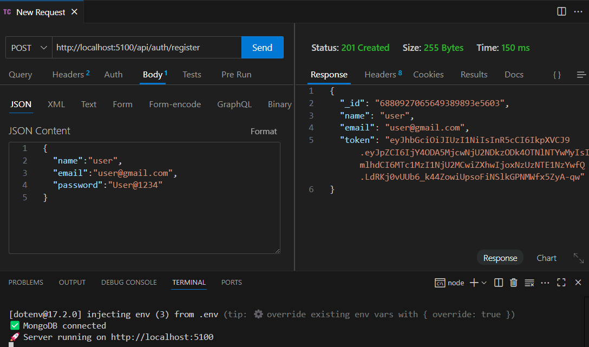|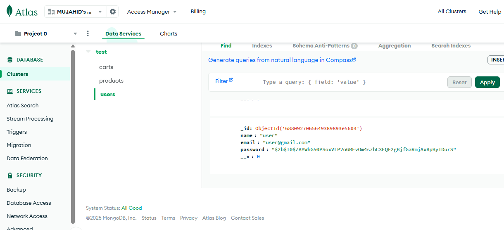|
| POST `/api/auth/login`    | Login user and get token | 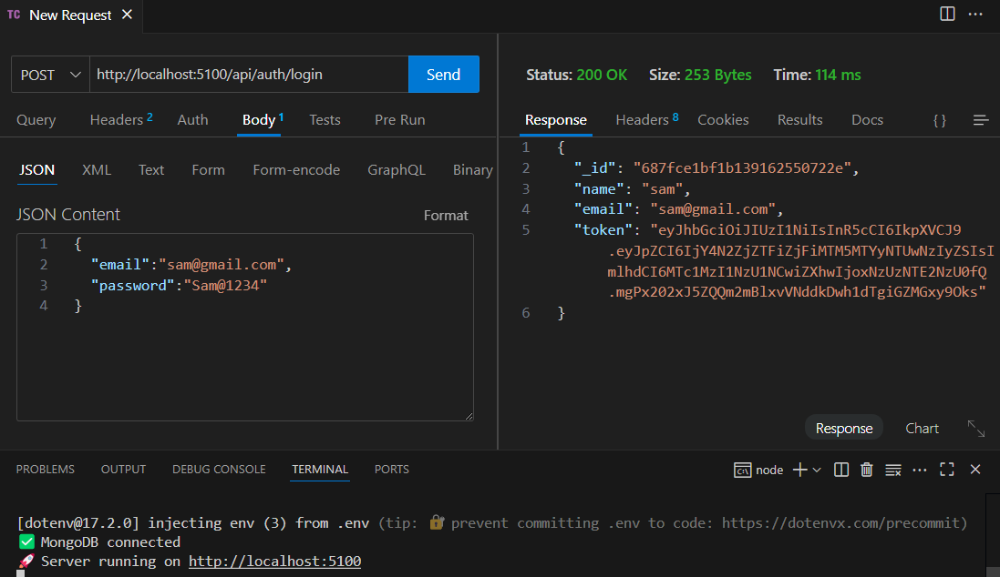      |      |

### 📦 Product Routes

| API Route               | Description        | ThunderClient Screenshot | MongoDB Screenshot           |
| ----------------------- | ------------------ | ------------------------ | ---------------------------- |
| GET `/api/products/`    | Get all products   | 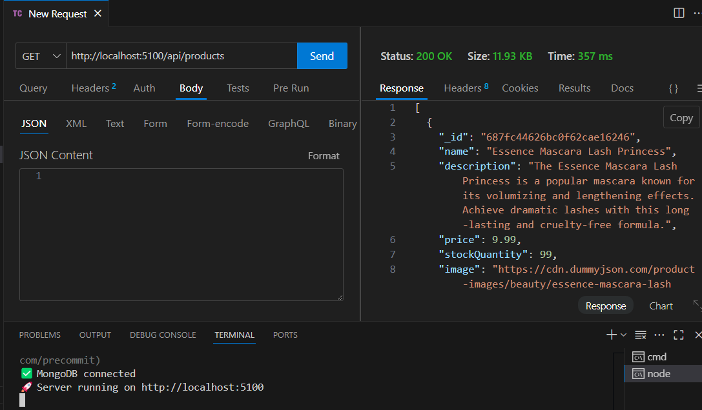    |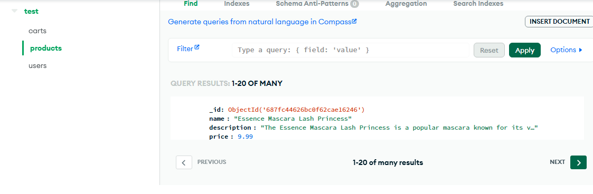        |
| GET `/api/products/:id` | Get single product |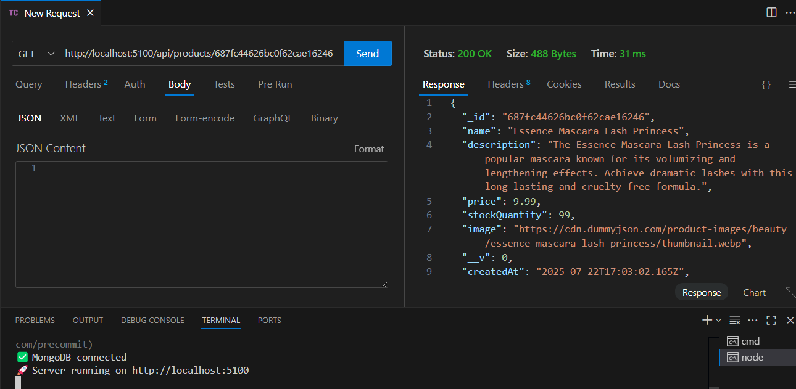|         |

### 🛒 Cart Routes

| API Route                     | Description                 | ThunderClient Screenshot | MongoDB Screenshot          |
| ----------------------------- | --------------------------- | ------------------------ | --------------------------- |
| POST `/api/cart/`             |Add to cart(Protected)(Add Bearer "tolken" in Authorization)| 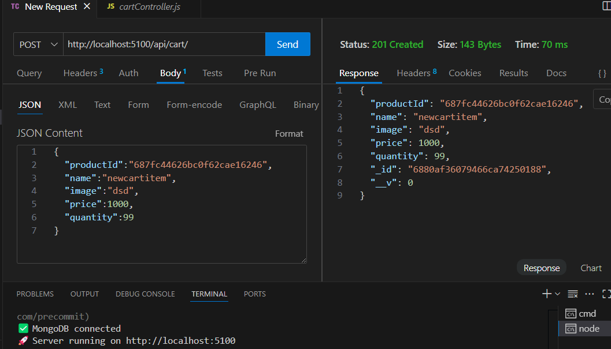|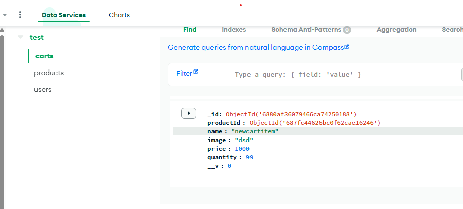     |
| GET `/api/cart/`              | Get cart (Protected)        |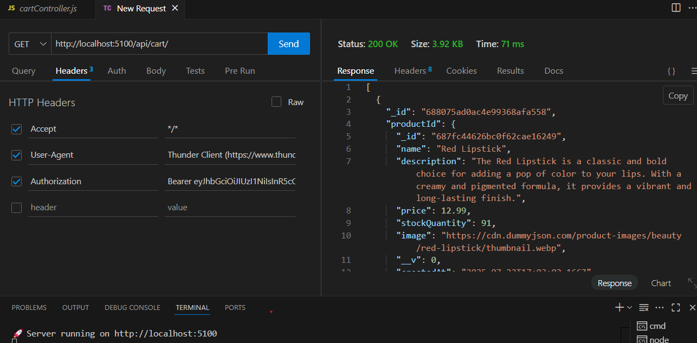                                 |      |
| PUT `/api/cart/:productId`    | Update quantity (Protected) |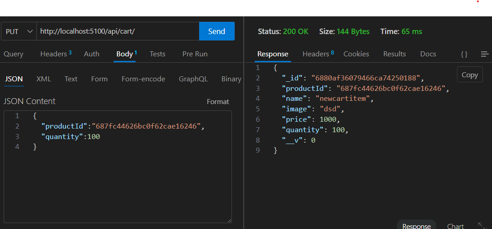 |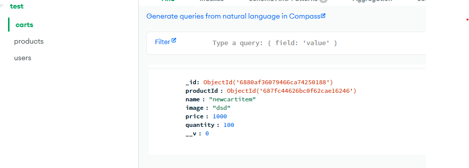 |
| DELETE `/api/cart/:productId` | Remove item (Protected)     |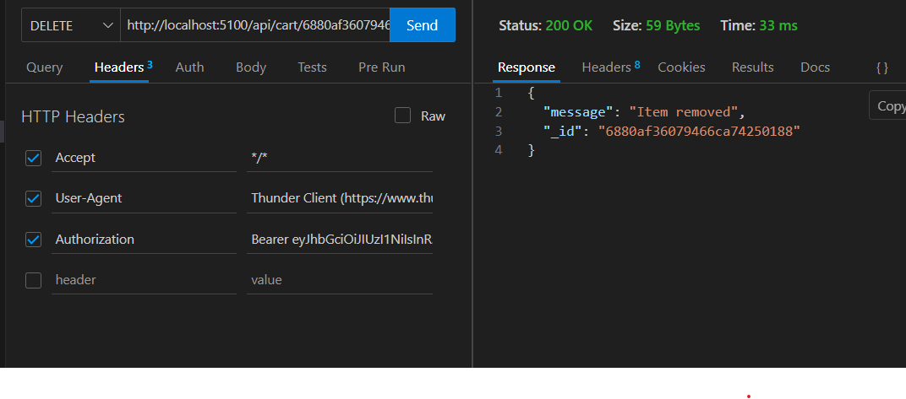   |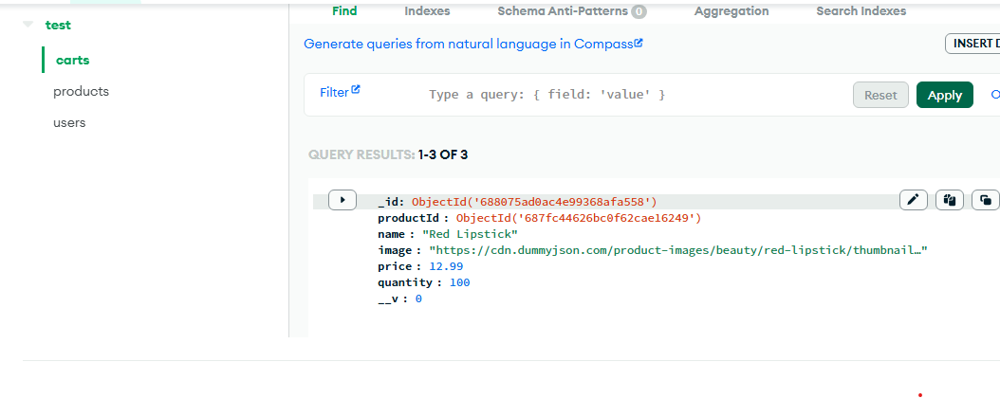 |


### ⚠️ Miscellaneous

| Test           | Description         | Screenshot            |
| -------------- | ------------------- | --------------------- |
|Validation      | "message": "Access denied. No token provided." | 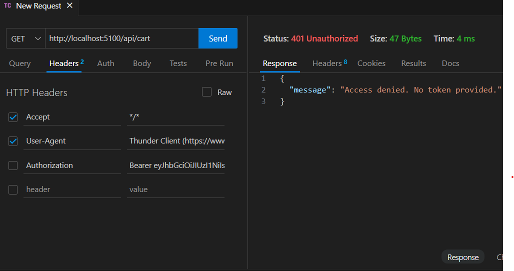   |

---

## 📁 Folder Structure

```
shoppyglobe/
├── server/
│   ├── utils/
│   ├── controllers/
│   ├── middleware/
│   ├── models/
│   ├── routes/
│   ├── .env
│   ├── server.js
│   ├── package.json
│
├── client/
│   ├── public/
│   ├── src/
│   │   ├── api/
│   │   ├── assets/
│   │   ├── components/
│   │   ├── context/
│   │   ├── redux/
│   │   ├── utils/
│   │   ├── App.jsx
│   │   ├── main.jsx
│   │   ├── index.css
│   ├── .env
│   ├── vite.config.js
│   ├── package.json
│
└── README.md
```

---

## 🔧 Environment Variables

### 🔒 Backend `.env`

```
NODE_ENV=development
PORT=5000
MONGO_URI=<your-mongodb-uri>
JWT_SECRET=<your-secret-key>
```

### 🌐 Frontend `.env`

```
VITE_API_BASE_URL=http://localhost:5000/api
```

> 🔁 Update to production URL after deployment.

---

## 📦 Installation

### 1️⃣ Clone the repository

```bash
git clone https://github.com/mujahidsayyed09/ShoppyGlobe-V2.git
cd ShoppyGlobe-V2
```

### 2️⃣ Backend setup

```bash
cd server
npm install
npm start
```

### 3️⃣ Frontend setup

```bash
cd client
npm install
npm run dev
```

Open browser at: [http://localhost:5173](http://localhost:5173)

---

## 🚀 Deployment

**Frontend:** https://shoppyglobev2.netlify.app
**Backend:** https://shoppyglobe-v2.onrender.com

Deploy with your GitHub and connect environment variables accordingly.

---

## 👤 Author

**Mujahid Sayyed**
📧 [mujahidsayed203@gmail.com](mailto:mujahidsayed203@gmail.com)
🔗 [GitHub](https://github.com/mujahidsayyed09) | [LinkedIn](https://www.linkedin.com/in/mujahidsayyed/) | [Portfolio](https://mujahidsayyed09.github.io/PORTFOLIO/)

---

> ✅ Feel free to fork, contribute, and improve this project!
